# 🚗 ACCA_2025: Autonomous Driving Competition Project

**자율주행자동차 경진대회 ACCA팀**의 ERP42 기반 자율주행 시스템입니다.  
LiDAR, GPS, IMU, 카메라를 융합하여 다양한 미션(콘 주행, 주차, 장애물 회피, 신호등 정지선 등)을 수행합니다.

---

# 대회 미션
> 예선1 : 사선주차, U턴, 터널 주행이 포함된 현실 도로 주행
> 
> 예선2 : 노란색, 파란색 꼬깔로 이루어진 랜덤 트랙 주행
> 
> 본선 : 배달미션, 신호등 인식, 후진 주차가 포함된 현실 도로 주행

---

## 📑 목차

- [System Architecture](#architecture)
- [패키지 목록](#packages)
- [Environment & Equipment](#environment)
- [Dependencies](#dependencies)
- [Build](#build)
- [Execution Guide](#execution)
- [패키지 의존 관계 요약](#dependency-graph)
- [주요 파라미터](#parameters)
- **[🙋 내 주요 업무](#my-work)**
  - [1. 카메라 위치 설정 및 카메라 화면 연결](#work-1)
  - [2. 라이다 센서 post-processing](#work-2)
  - [3. 카메라 라이다 센서 퓨전](#work-3)
  - [4. YOLO 모델 선정](#work-4)
  - [5. 꼬깔, 배달위치, 신호등, 차선 데이터 YOLO 학습](#work-5)
  - [6. 예선2 Path 생성 알고리즘 구현](#work-6)
  - [7. 예선2 테스트 주행](#work-7)
  - [8. 본선 신호등 시간 체크 및 구간별 필요시간 파악](#work-8)
- **[🔧 Trouble Shooting](#trouble-shooting)**
  - [1. 3D LiDAR의 정보 불충분](#trouble-1)
  - [2. 자동차 부재로 인한 실험 난항](#trouble-2)
  - [3. Path 정확도 문제](#trouble-3)
  - [4. fusion 정확도 문제](#trouble-4)
  - [5. yolo 모델에 따른 인식문제](#trouble-5)

---

<a id="architecture"></a>
## 🏗️ System Architecture

본 프로젝트는 **센서 → 인식 → local → 경로계획 → 제어** 의 자율주행 전체 파이프라인을 ROS2(Humble)로 구현합니다.

### 전체 데이터 흐름

```
[Hardware]
  ERP42 차량 + Velodyne LiDAR + Ublox GPS + Xsens IMU + 카메라(3대)
       │
[Sensor Driver Layer]
  erp42_communication / ublox / ntrip_ros2 / Xsens_MTi_ROS_Driver
       │
[Perception Layer]
  plane_fit_ground_filter → adaptive_clustering → fusion(Camera-LiDAR)
  crop(CropBox) ──────────────────────────────────────────────────────
       │
[Localization Layer]
  localization(GPS+IMU+Encoder) + lidar_localization(NDT/GICP)
  robot_localization(EKF) + tf(map↔odom TF)
       │
[Planning Layer]
  create_db / path_making (경로 녹화)
  path_plan_cone (콘 기반 경로생성)
  costmap_has (주차: Costmap + Hybrid A*)
  obstacle_avoidance (장애물 우회)
  no_gps_pth (GPS 없는 환경: RRT*)
       │
[Control Layer]
  erp42_control (미션별 Stanley/MPC/PurePursuit 컨트롤러)
```

---

<a id="packages"></a>
## 📦 패키지 목록

### 🔌 센서 드라이버 (`src/sensor/`)

| 패키지 | 역할 |
|---|---|
| `erp42_communication` | ERP42 차량과 시리얼 통신, 제어 명령 송수신 및 피드백 수신 |
| `ublox` | Ublox GPS 수신기 드라이버 (`sensor_msgs/NavSatFix` 발행) |
| `ntrip_ros2` | NTRIP 프로토콜 기반 RTK 보정 데이터 수신 (고정밀 GPS) |
| `Xsens_MTi_ROS_Driver_and_Ntrip_Client-ros2` | Xsens MTi 시리즈 IMU 드라이버 (가속도, 각속도, 방향 발행) |

---

### 📐 커스텀 메시지 정의

#### `erp42_msgs`
ERP42 차량 제어에 필요한 커스텀 메시지 타입 정의

| 메시지 | 설명 |
|---|---|
| `ControlMessage` | 속도(KPH), 조향(DEG), 기어, E-Stop 명령 |
| `SerialFeedBack` | 차량 피드백 (속도 m/s, 조향 rad) |
| `AckermannDriveStamped` | Ackermann 조향 명령 |
| `StanleyError` | Stanley 컨트롤러 오차 정보 |

#### `adaptive_clustering_msgs`
| 메시지 | 설명 |
|---|---|
| `ClusterArray` | LiDAR 클러스터 배열 (헤더 + Cluster 리스트) |

---

### 🧭 local (Localization)

#### `localization`
GPS, IMU, 엔코더를 융합하여 차량의 위치와 방향을 추정합니다.

| 파일 | 역할 |
|---|---|
| `gps_imu_encoder_odometry.py` | IMU 방향 + 엔코더 속도를 결합한 주 오도메트리 |
| `wheel_odometry.py` | 엔코더 기반 휠 오도메트리 |
| `imu_odometry.py` | IMU 단독 오도메트리 |
| `kf_localization.py` / `kalman_localization.py` | 칼만 필터 기반 위치 추정 |
| `gps_odom.py` | GPS 신호를 Odometry 메시지로 변환 |
| `map_server.py` / `real_time_map_server.py` | 사전 제작된 경로 맵 서버 |

#### `lidar_localization_ros2-humble`
3D LiDAR 포인트클라우드와 사전 제작된 PCD 맵을 매칭하여 cm급 정밀 local를 수행합니다.
- **NDT (Normal Distributions Transform)** / **GICP** / **NDT_OMP** 알고리즘 지원
- 입력: `/cloud`, `/map`, `/odom`, `/imu` → 출력: `/pcl_pose`

#### `ndt_omp_ros2-humble`
NDT 알고리즘의 OpenMP 병렬 가속화 라이브러리 (`lidar_localization`의 의존성)

#### `robot_localization`
EKF(Extended Kalman Filter) / UKF를 이용해 여러 오도메트리 소스를 융합하는 표준 ROS2 패키지

#### `tf`
좌표계 변환(TF) 관리 노드 모음

| 파일 | 역할 |
|---|---|
| `map_odom_tf_publisher_static.cpp` | GPS 기반 map↔odom 정적 TF 발행 |
| `map_odom_tf_publisher_MLB.cpp` | MLB 방식 map↔odom TF 발행 |
| `odometry_map_frame.cpp` | Odometry를 map 프레임으로 변환 |
| `localization_path_tf.cpp` | 경로 TF 변환 |

---

### 👁️ 인식 (Perception)

#### `plane_fit_ground_filter`
LiDAR 포인트클라우드에서 **평면 피팅(Plane Fitting)** 방식으로 지면을 제거합니다.
- 입력: `/cropbox_filtered` → 출력: `/points_no_ground`, `/points_ground`
- 파라미터: `sensor_height`, `th_seeds`, `th_dist`, `num_iter` 등

#### `crop` / `fusion` (CropBox)
Velodyne LiDAR의 관심 영역(ROI)만 통과시키는 **CropBox 필터**입니다.
- 차량 주변 특정 범위 내 포인트만 추출
- 다양한 실험 환경 버전(학교, KCity) 및 용도별(라인검출, 콘검출) 버전 포함

#### `adaptive_clustering`
지면 제거 후 포인트클라우드에서 **Euclidean 클러스터링**으로 개별 객체(콘, 장애물)를 탐지합니다.
- VLP-16/32 등 센서 모델에 따라 클러스터링 파라미터 자동 조정
- 출력: 각 클러스터의 중심 좌표 (`PoseArray`) + 바운딩박스 마커

#### `fusion`
**카메라-LiDAR 퓨전**으로 콘의 색상(노랑/파랑)을 판별합니다.
- YOLO(`darknet_ros`)의 바운딩박스 + LiDAR 콘 위치를 Projection 행렬로 매칭
- 3대 카메라(좌/중/우) 지원
- 출력: `point/yellow` (노란 콘), `point/blue` (파란 콘)

#### `opencv_lane`
카메라 이미지를 **그레이스케일**로 변환하여 차선 검출 전처리를 수행하는 노드

#### `pointcloud_visualizer`
저장된 `.pcd` 파일을 RViz2에서 시각화하는 노드 (VoxelGrid 다운샘플링 적용)

---

### 🗺️ 경로 관리 (Path Management)

#### `create_db`
주행 중 수집한 경로 포인트를 **SQLite 데이터베이스**로 저장·관리합니다.

| 파일 | 역할 |
|---|---|
| `DB.py` | SQLite 기반 경로 DB (Node/Path 테이블) |
| `path_making.py` / `path_making_bs.py` | 주행하며 경로 포인트 실시간 녹화 |
| `path_collector.py` | 경로 포인트 수집기 |
| `path_separate.py` | 녹화된 경로를 미션 구간별로 분리 |

#### `path_making`
경로 녹화 유틸리티 패키지 (`create_db`의 보조 도구)

---

### 🛣️ 경로 계획 (Path Planning)

#### `path_plan_cone`
노란/파란 콘 위치로부터 **Delaunay 삼각분할**을 이용해 콘 중앙 경로를 실시간 생성합니다.
- 콘 간 중점을 연결하여 주행 경로 생성
- Cubic Spline 보간으로 부드러운 경로 출력

#### `costmap_has`
**주차 미션**을 위한 Costmap 기반 경로 계획 패키지

| 파일 | 역할 |
|---|---|
| `costmap.py` | 콘 위치 기반 OccupancyGrid Costmap 생성 (decay 적용) |
| `path_planner.py` | **Hybrid A\*** 알고리즘으로 주차 경로 계획 |
| `pure_pursuit.py` | Pure Pursuit 기반 경로 추종 |
| `PathPlanning/HybridAStar/` | Hybrid A* + Reeds-Shepp 경로 구현 |

#### `obstacle_avoidance`
전방 장애물 감지 시 **좌/우 우회 경로**를 자동 선택하여 발행합니다.
- 미리 저장된 좌/우 우회 경로(txt) + 전역 경로(txt) 관리
- GPS 좌표 변환(EPSG:4326 → EPSG:2097) 포함

#### `no_gps_pth`
GPS 신호 없는 실내/음영 구역에서 **RRT\* 알고리즘**으로 경로를 계획합니다.
- Costmap을 구독하여 장애물 회피 경로 탐색
- Stanley 컨트롤러로 경로 추종

---

### 🔄 좌표 변환 (TF Conversion)

#### `tf_cone`
카메라-LiDAR 퓨전 결과(velodyne 프레임)의 콘 위치를 **odom 프레임**으로 변환합니다.
- 노란/파란 콘 각각의 TF 변환 처리
- 콘 위치 누적 카운팅 버전 포함

#### `parking_tf`
콘 클러스터 위치(velodyne 프레임)를 **map 프레임**으로 변환합니다. (주차 미션용)
- `cone_pose_transform.cpp`: `/cone_poses` → `/cone_poses_map` 변환

---

### 🎮 차량 제어 (Vehicle Control)

#### `erp42_control`
각 경진대회 미션에 특화된 Stanley/PID/MPC 컨트롤러 모음입니다.  
모든 컨트롤러는 `erp42_msgs/ControlMessage`를 발행하여 차량을 구동합니다.

| 파일 | 미션 | 설명 |
|---|---|---|
| `controller_cone.py` | 🟡 콘 슬라롬 | 콘 사이 Stanley 추종, 속도 적응 조절 |
| `controller_cone_mpc.py` | 🟡 콘 슬라롬 (MPC) | Iterative Linear MPC 기반 콘 주행 |
| `controller_cone_mpc_curve.py` | 🟡 콘 슬라롬 (곡선 MPC) | 곡선 구간 MPC 최적화 |
| `controller_traffic_light.py` | 🚦 신호등 | 신호등 인식 후 정지/출발 제어 |
| `controller_stop_line.py` | ⛔ 정지선 | 정지선 감지 및 일시 정지 |
| `controller_parking.py` | 🅿️ 주차 | Hybrid A* 경로 추종 주차 |
| `controller_obstacle.py` | 🚧 장애물 회피 | 장애물 감지 시 우회 경로 전환 |
| `controller_delivery.py` | 📦 배달 | 배달 지점 이동 및 복귀 (전진/후진) |
| `controller_uturn.py` | 🔄 U-턴 | DB 경로 기반 U-턴 수행 |
| `controller_pickup.py` | 🤝 픽업 | 픽업 지점 정차 및 출발 |
| `iterative_linear_mpc.py` | 🧠 MPC 공통 | cvxpy 기반 Iterative Linear MPC 구현 |
| `DB.py` | 💾 DB 공통 | SQLite 경로 DB 읽기/쓰기 |

---

<a id="environment"></a>
## 🖥️ Environment & Equipment

### Software
- **OS**: Ubuntu 22.04 LTS
- **ROS2**: Humble
- **Language**: Python 3.10, C++17
- **Database**: SQLite3

### Hardware
- **차량**: ERP42 (전기차 기반 자율주행 플랫폼)
- **LiDAR**: Velodyne VLP-16 / VLP-32
- **GPS**: Ublox (RTK 보정: NTRIP)
- **IMU**: Xsens MTi 시리즈
- **카메라**: 3대 (좌/중/우) + YOLO(darknet_ros) 객체 검출

---

<a id="dependencies"></a>
## 📦 Dependencies

```bash
# ROS2 Humble 기본 패키지 외 추가 의존성
sudo apt install ros-humble-robot-localization
sudo apt install ros-humble-tf2-ros ros-humble-tf2-geometry-msgs
sudo apt install ros-humble-pcl-ros ros-humble-pcl-conversions
sudo apt install ros-humble-tf-transformations

# Python 의존성
pip install pyproj scipy shapely cvxpy

# 외부 ROS2 패키지 (별도 클론 필요)
# darknet_ros_msgs (YOLO 바운딩박스 메시지)
# nmea_msgs, mavros_msgs
```

---

<a id="build"></a>
## 🔨 Build

```bash
# 저장소 클론
git clone https://github.com/beomseok3/ACCA_2025
cd ACCA_2025

# 커스텀 메시지 먼저 빌드 (필수!)
colcon build --symlink-install --packages-select adaptive_clustering_msgs erp42_msgs
source install/setup.bash

# 전체 빌드
colcon build --symlink-install
source install/setup.bash
```

---

<a id="execution"></a>
## 🚀 Execution Guide

### 1. 센서 구동
```bash
# GPS (Ublox)
ros2 launch ublox_gps ublox_gps_node-launch.py

# IMU (Xsens)
ros2 launch xsens_mti_ros2_driver xsens_mti_node.launch.py

# LiDAR (Velodyne)
ros2 launch velodyne_driver velodyne_driver_node-VLP16-launch.py

# ERP42 차량 통신
ros2 run erp42_communication erp42_serial_node
```

### 2. local 구동
```bash
# GPS+IMU+엔코더 오도메트리
ros2 run localization gps_imu_encoder_odometry

# map↔odom TF 발행
ros2 run tf map_odom_tf_static

# EKF 퓨전 (robot_localization)
ros2 launch robot_localization ekf.launch.py
```

### 3. 인식 파이프라인 구동
```bash
# CropBox 필터 → 지면 제거 → 클러스터링 → 카메라-LiDAR 퓨전
ros2 launch costmap_has all_launch.py
```

### 4. 미션별 경로 계획 구동 예시

```bash
# 콘 슬라롬: 콘 좌표 변환 후 Delaunay 경로 생성
ros2 run tf_cone cone_in_odom_frame
ros2 run path_plan_cone path_cone

# 주차: Costmap 생성 후 Hybrid A* 계획
ros2 run parking_tf cone_pose_transform
ros2 run costmap_has costmap
ros2 run costmap_has path_planner

# 장애물 회피
ros2 run obstacle_avoidance obstacle_avoid
```

### 5. 차량 제어 노드 구동

```bash
# 예시: 콘 슬라롬 미션
ros2 run erp42_control controller_cone

# 예시: 주차 미션
ros2 run erp42_control controller_parking

# 예시: 신호등 미션
ros2 run erp42_control controller_traffic_light
```
---

<a id="dependency-graph"></a>
## 📁 패키지 의존 관계 요약

```
erp42_msgs ←─── erp42_control
                     ↑
adaptive_clustering_msgs ←── adaptive_clustering
                                    ↑
plane_fit_ground_filter → [points_no_ground] → adaptive_clustering
crop/fusion(cropbox) ──→ [cropbox_filtered] → plane_fit_ground_filter
fusion(camera-lidar) ──→ [yellow/blue point] → tf_cone → path_plan_cone
                                            → parking_tf → costmap_has
localization ──→ [odometry] ──→ erp42_control
lidar_localization ──→ [pcl_pose] ──→ robot_localization(EKF)
create_db / path_making ──→ [.db 파일] ──→ erp42_control
```


---

<a id="parameters"></a>
## ⚠️ 주요 파라미터

### Stanley 컨트롤러 공통 파라미터
| 파라미터 | 기본값 | 설명 |
|---|---|---|
| `/stanley_controller/p_gain_*` | 2.07 | 미션별 P 게인 |
| `/stanley_controller/i_gain_*` | 0.85 | 미션별 I 게인 |
| `/speed_supporter/he_gain_*` | 40.0~50.0 | 헤딩 오차 속도 보정 게인 |
| `/speed_supporter/ce_gain_*` | 20.0~30.0 | 곡률 오차 속도 보정 게인 |

### Adaptive Clustering 파라미터
| 파라미터 | 기본값 | 설명 |
|---|---|---|
| `z_axis_min` | -0.8 | 클러스터링 최소 z 높이 |
| `z_axis_max` | 2.0 | 클러스터링 최대 z 높이 |
| `x_threshold` / `y_threshold` | 0.5m | 콘 크기 필터 임계값 |
| `cluster_size_min/max` | 5 / 100 | 유효 클러스터 포인트 수 범위 |

---

<a id="my-work"></a>
## 🙋 내 주요 업무

<a id="work-1"></a>
### 1. [카메라 위치 설정 및 카메라 화면 연결]
> 좌/중/우 3대의 카메라로 차량 전방 시야를 확보하고, 각 카메라 영상을 하나의 인식 파이프라인에서 사용할 수 있도록 연결
> 1. 차량 전방 사각지대를 최소화할 수 있는 좌/중/우 카메라 거치 위치 및 각도 선정
> 2. 각 카메라(`camera1/2/3`)의 `/image_raw` 토픽을 개별 노드(`image_concat_bs.cpp`)에서 수신
> 3. `cv_bridge`로 ROS 이미지 ↔ OpenCV 행렬 변환 후 `concated_cam` 토픽으로 재발행
> 4. YOLO 인식 노드가 3대의 화면을 동시에 입력받아 처리할 수 있도록 카메라별 프레임 동기화 확인

<!-- 카메라 거치 위치 / concat 결과 사진 -->

---

<a id="work-2"></a>
### 2. [라이다 센서 post-processing]
> 3D LiDAR 원본 포인트클라우드에서 콘/장애물만 남기기 위해 아래 순서로 전처리 파이프라인을 구성
> 1. **CropBox 필터** (`crop`/`fusion`) — 차량 기준 관심 영역(전방 x, 좌우 y 범위) 밖의 포인트 제거
> 2. **지면 제거** (`plane_fit_ground_filter`) — 평면 피팅으로 바닥에 해당하는 포인트 제거 (`sensor_height`, `th_dist` 기준)
> 3. **Adaptive Clustering** (`adaptive_clustering`) — 남은 포인트를 Euclidean 거리 기준으로 군집화하여 콘/장애물 단위 객체로 분리
> 4. 각 클러스터의 중심 좌표를 `PoseArray`로 발행하여 다음 단계(카메라-라이다 퓨전)에 전달

<table>
  <tr>
    <td align="center"><b>① 원본 LiDAR</b></td>
    <td align="center"><b>② CropBox 필터</b></td>
    <td align="center"><b>③ 지면 제거</b></td>
    <td align="center"><b>④ 클러스터링 완료</b></td>
  </tr>
  <tr>
    <td>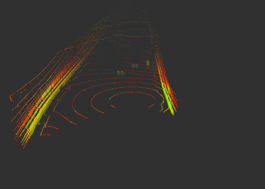</td>
    <td>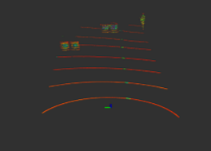</td>
    <td>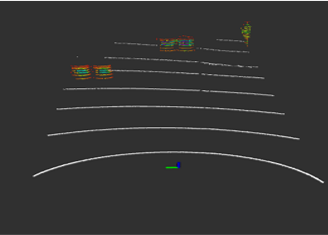</td>
    <td>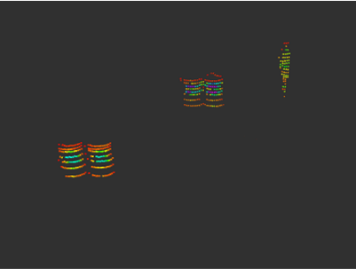</td>
  </tr>
</table>

---

<a id="work-3"></a>
### 3. [카메라 라이다 센서 퓨전]
> LiDAR로 얻은 콘의 3D 위치와 카메라로 얻은 콘의 색상(YOLO 바운딩박스)을 결합하여 "어디에 어떤 색의 콘이 있는지" 판단
> 1. LiDAR 클러스터 중심점(`/cone_poses`)을 카메라 좌표계로 변환 (Extrinsic, `R_RTlc`, `C_RTlc`, `L_RTlc`)
> 2. 변환된 3D 점을 카메라 Intrinsic 행렬(`R_Mc` , `C_Mc`, `L_Mc`)로 이미지 평면에 투영(Projection)
> 3. 투영된 픽셀 좌표가 YOLO 바운딩박스 내부에 포함되는지 검사하여 콘의 색상(노랑/파랑) 결정
> 4. 색상이 매칭된 콘 위치를 `point/yellow`, `point/blue`로 각각 발행

<table>
  <tr>
    <td align="center"><b>LiDAR 3D 포인트 → 카메라 좌표계(2D 투영 전)</b></td>
    <td align="center"><b>3D → 2D Projection 결과</b></td>
  </tr>
  <tr>
    <td>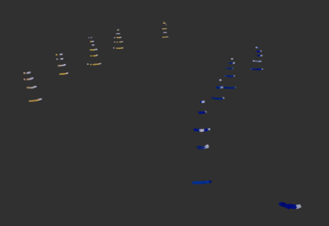</td>
    <td>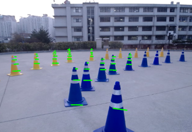</td>
  </tr>
</table>

---

<a id="work-4"></a>
### 4. [YOLO 모델 선정]
> 실시간성과 인식 정확도를 모두 만족하는 YOLO 모델 버전을 비교 실험을 통해 선정
> 1. 최신 YOLO 모델들의 추론 속도(FPS) / 정확도(mAP) 비교
> 2. 콘이 다닥다닥 붙어 있는 상황에서 바운딩박스 기반 모델의 한계(겹침으로 인한 오인식) 확인
> 3. 박스가 아닌 객체의 외곽선만 추출하는 **Segmentation 모델**로 전환하여 밀집 콘 구간 인식률 개선 (자세한 원인/해결은 [Trouble Shooting #5](#5-yolo-모델에-따른-인식문제) 참고)

<table>
  <tr>
    <td align="center"><b>YOLO 모델별(v8~v12) 학습 결과 비교</b></td>
    <td align="center"><b>모델별 인식률(Precision) 비교</b></td>
  </tr>
  <tr>
    <td>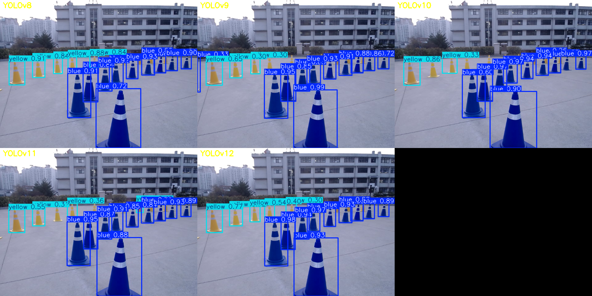</td>
    <td>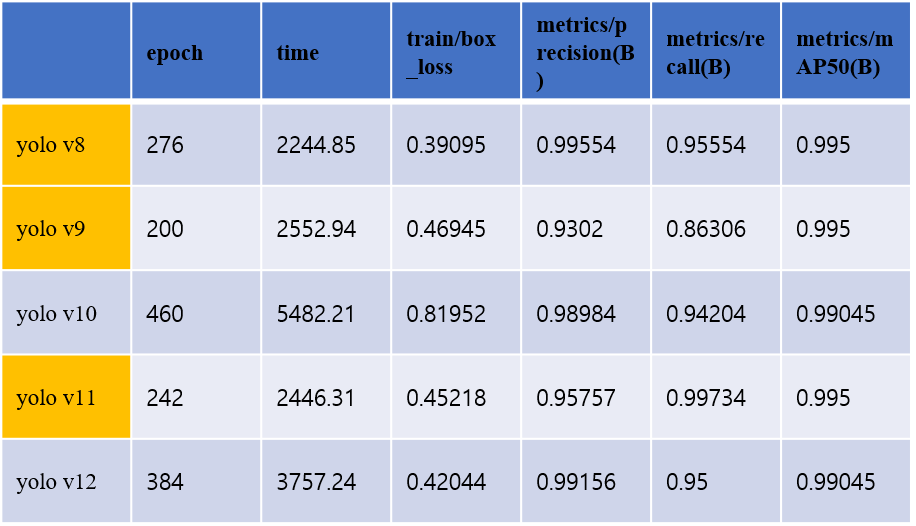</td>
  </tr>
</table>

> 최대 1000 에포크 학습 실험 결과, YOLOv8은 최신 버전들(v9~v12) 대비 가장 짧은 시간(2244초) 내에 최적의 수렴을 이루었으며, 특히 이미지 상의 객체 위치 정확도를 대변하는 box_loss가 0.39095로 가장 낮고 정밀도(Precision)가 0.99554로 가장 높아, 3D 공간 투영 및 센서 퓨전의 정확도를 극대화하기에 가장 적합한 밸런스 모델로 판단하여 선정함.

---

<a id="work-5"></a>
### 5. [꼬깔, 배달위치, 신호등, 차선 데이터 YOLO 학습]
> 대회 미션 수행에 필요한 4종 객체(콘, 배달 표지판, 신호등, 차선)에 대한 학습 데이터셋 구축 및 모델 학습
> 1. 실제 주행 환경(학교, KCity)에서 각 객체가 포함된 영상을 다양한 거리/조도 조건으로 수집
> 2. 콘(노랑/파랑 구분), 배달 표지판, 신호등(빨강/주황/초록 구분), 차선에 대해 라벨링 진행
> 3. 학습된 가중치를 YOLO 추론 노드에 적용하여 실주행 환경에서 검증
> 4. 오인식 케이스를 추가 수집하여 데이터셋을 보강하는 반복 학습 진행

<table>
  <tr>
    <td align="center"><b>배달 표지판 인식</b></td>
    <td align="center"><b>신호등 인식</b></td>
  </tr>
  <tr>
    <td>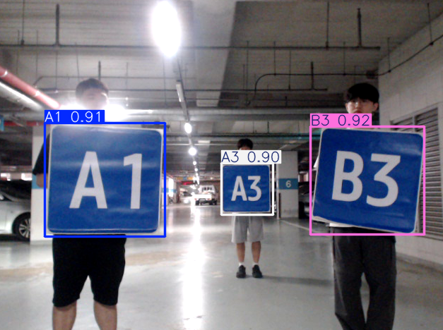</td>
    <td>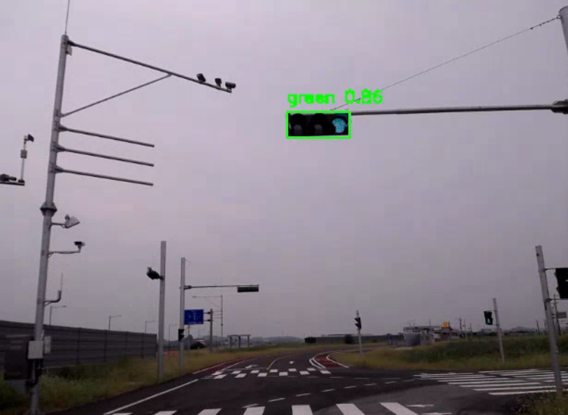</td>
  </tr>
</table>

---

<a id="work-6"></a>
### 6. [예선2 Path 생성 알고리즘 구현]
> 노란/파란 콘으로 구성된 랜덤 트랙에서, 콘 인식 결과만으로 실시간 주행 경로를 생성하는 알고리즘 구현 (`path_plan_cone`)
> 1. 단순히 좌/우 콘의 중점을 잇는 방식은 한쪽 콘 누락·콘 수 불일치 시 경로가 불안정해지는 문제 확인
> 2. **들로네 삼각분할(Delaunay Triangulation)** 으로 인식된 모든 콘에 대해 삼각형 메쉬 구성
> 3. 서로 다른 색의 콘을 잇는 삼각형 변(edge)들의 중점을 추출하여 주행 가능 경로 포인트로 사용
> 4. Cubic Spline으로 포인트를 보간하여 부드러운 곡선 경로로 변환 후 발행 (`del_path`)

<p align="center">
  <b>들로네 삼각분할(Delaunay Triangulation) 기반 콘 트랙 경로 생성</b><br/>
  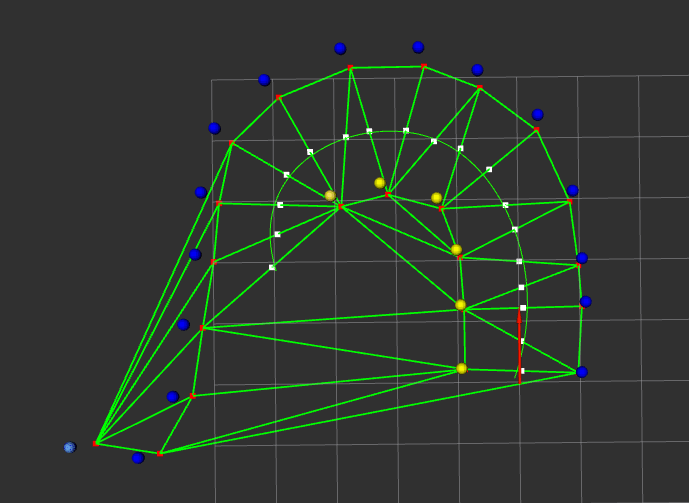
</p>

---

<a id="work-7"></a>
### 7. [예선2 테스트 주행]
> 들로네 기반 경로 생성 알고리즘을 실차(ERP42)에 적용하여 콘 트랙 테스트 주행 진행

[▶️ 예선2 테스트 주행 영상](https://youtu.be/I1te0d2H01U)

---

<a id="work-8"></a>
### 8. [본선 신호등 시간 체크 및 구간별 필요시간 파악]
> 본선 코스의 각 신호등 구간(`traffic_light_sections`)에서 신호 주기와 구간별 통과 소요시간을 사전에 파악하여 정지/출발 로직 튜닝
> 1. 코스 내 7개 신호등 구간의 적색/녹색 신호 ID를 사전 매핑 (`controller_traffic_light.py`)
> 2. 각 구간 진입 시점부터 통과까지 걸리는 실제 주행 소요시간을 반복 측정
> 3. 신호 전환 오인식 방지를 위한 `time_threshold`(신호 유지 판정 시간) 값 설정
> 4. 측정한 구간별 소요시간을 기준으로, 신호 대기 중 정차 위치와 재출발 타이밍 조정

<p align="center">
  <b>구간별 신호등 통과 소요시간 비교</b><br/>
  
</p>

---

<a id="trouble-shooting"></a>
## 🔧 Trouble Shooting

<a id="trouble-1"></a>
### 1. 3D LiDAR의 정보 불충분
**증상** > 3D LiDAR만으로는 꼬깔의 색깔을 인식하기 어려워, 코너 주행시 경로를 잘 찾지 못함.

**원인** > LiDAR의 x축을 기준으로 왼쪽이 노란색 꼬깔, 오른쪽이 파란색 꼬깔이라고 설정을 했을때, 코너에 있는 콘들은 정확히 판단할 수 없음

**해결** > RGB camera를 이용하여, camera로는 색깔 인식을, LiDAR로는 꼬깔의 위치를 파악하여 이를 통합. camera LiDAR fusion을 통한 높은 인식률 달성

---

<a id="trouble-2"></a>
### 2. 자동차 부제로 인한 실험 난황
**증상** > erp-42를 쓸 수 없어, 실험 확인 및 주행에 큰 차질이 생김.

**원인** > erp-42를 이용한 실험 도중, 내리막길에서 조종기의 통제권이 풀리면서 그대로 벽에 부딪힘. 이로 인한 정밀 검사 요청

**해결** > 원래의 일정에 맞추기 위해서는 실험을 계속 해야했기 때문에, 자동차 위에 사용하던 플랫폼을 그대로 구르마에 장착하여 control 부분을 뺀 나머지 부분을 실험

<table>
  <tr>
    <td align="center"><b>정상 차량 (URDF)</b></td>
    <td align="center"><b>고장 발생 후</b></td>
  </tr>
  <tr>
    <td></td>
    <td></td>
  </tr>
</table>

---

<a id="trouble-3"></a>
### 3. Path 정확도 문제
**증상** > 꼬깔의 색을 잘 인식하더라도, 양쪽 꼬깔의 수가 다르거나 만약 인식하지 못한 꼬깔이 생긴다면, path가 안정적으로 나오지 않음

**원인** > 양쪽의 꼬깔을 보고 중심점을 만들어 그 중심점끼리를 연결하여 path를 만드는데, 양쪽의 꼬깔이라는 개념이 모호함.

**해결** > 들로네 삼각분할법을 이용하여, 서로의 선을 지나지 않는 삼각형들을 만들어, 그 삼각형 선분의 중심을 지나가는 path를 생성하도록 함.

---

<a id="trouble-4"></a>
### 4. fusion 정확도 문제
**증상** > 처음에 calibration을 잘 해놓더라도, 시간이 지날수록 하나의 경향을 띄며 fusion에 오차가 생김.

**원인** > 차가 주행을 하면서 생기는 떨림, 사람 조작 실수로 인한 camera or LiDAR 회전 등올 인한 튜닝값 오차.

**해결** > 계속해서, calibration을 진행할수는 없기에, fusion test용 파일로 경향을 파악. 오차가 생기는 픽셀값을 파악하여, 계산된 값에 더하거나 빼서 경향을 맞춰줌.

---

<a id="trouble-5"></a>
### 5. yolo 모델에 따른 인식문제
**증상** > 일반 boundingbox를 사용할때 콘이 다닥다닥 붙어있다면 인식률이 확 떨어짐

**원인** > LiDAR에서 나오는 좌표를 카메라에 투영시키는데, 이때 boundingbox안에 들어가는지를 확인함. 만약 찍히는 점이 boundingbox가 겹치는 부분이라면 정확히 인식하지 못함.

**해결** > boundingbox가 아니라, segmentation모델을 사용해서 masking을 하여 그 안으로 투영된 값들만 사용하도록 함.

<table>
  <tr>
    <td align="center"><b>Bounding Box(Detect) 모델</b></td>
    <td align="center"><b>Segmentation 모델</b></td>
  </tr>
  <tr>
    <td>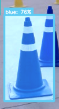</td>
    <td>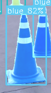</td>
  </tr>
</table>

---
